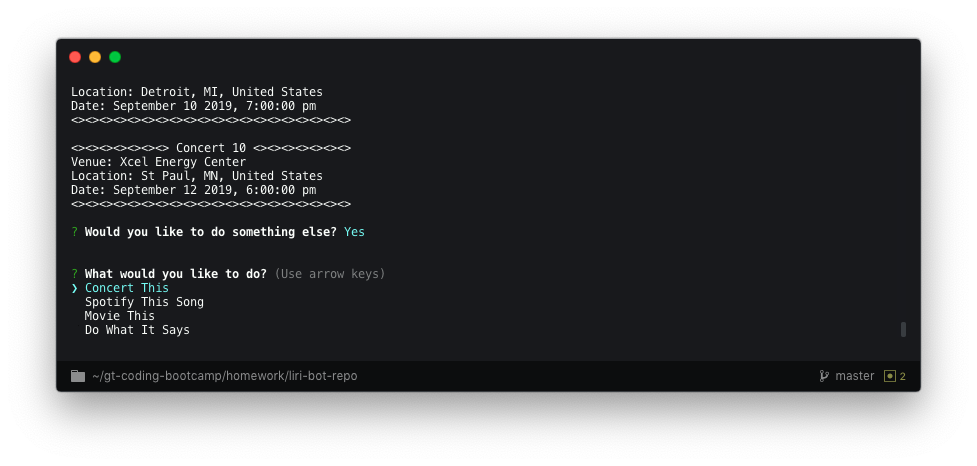

# Homework 8: LIRI Bot
This is Taylor Johnson's Homework 8: LIRI Bot for the Georgia Tech Coding Boot Camp. LIRI Bot is similar to Apple's Siri except that it takes input requests through the terminal command line. Specifically, LIRI Bot can perform four tasks:
1. Concert This: looks up the next ten concerts for an artist
2. Spotify This Song: looks up information for a song or track
3. Movie This: looks up information for a movie
4. Do What It Says: reads from a text file to perform one of the tasks above

## Libraries/Modules Uses
1. Vanilla JavaScript
2. Node.js
3. Inquirer - user command line input
4. Axios - calling APIs using HTTP requests
5. Moment - formatting of date/time
6. FS - reading text files
7. Spotify API - making calls to Spotify API from Node

## Methods

**1. loginUser()**
    This function allows the user to log in and enter his/her name for personalization. This also is the initial funciton that is invoked to start the program.
    
**2. pickTask()**
    This function allows the user to pick the task he/she wants to complete. This is called recursively throughout the program by the somethingElse() function if the user wishes to perform another task.
    
**3. somethingElse()**
    This function allows the user to choose to perform another task or quit the program. It is invoked recursively after every task is successfully completed or failed.
    
    
**4. concertThis()**
    This function allows the user to enter an artist/band name to get information on the next ten concerts. 
    
    
**5. spotifyThis()**
    This function allows the user to enter a song/track name to get information on it.
    
    
**6. movieThis()**
    This function allows the user to enter a moive name to get information on it.
    
    
**7. doIt()**
    This function will read the random.txt file in the repo and execute the task indicated within: Concert This, Spotify This Song, or Movie This.
    
    

